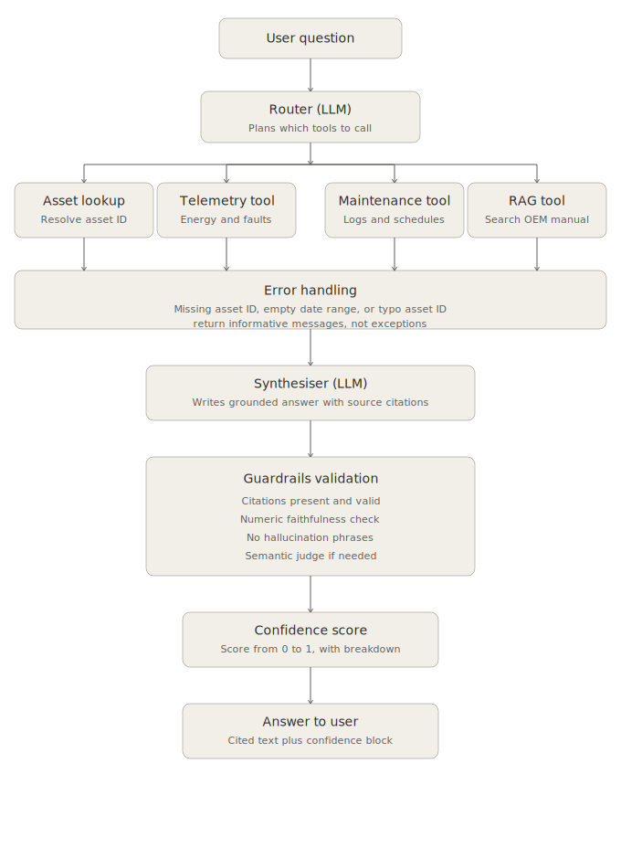

# Horizon AI — Renewable Energy Asset Intelligence

A production-minded RAG + LangGraph agent for answering natural-language questions
about wind turbine and solar plant operations, maintenance, and fault codes.

---

## Quick start

```bash
pip install -r requirements.txt
cp .env.example .env          # add your OPENAI_API_KEY
python demo.py                # builds vector store on first run (~10s), then 5 questions
python main.py                # interactive chat
python evaluation/eval.py     # 8 ground-truth test cases
```

---

## Data strategy — what gets embedded and why

| File | Rows | Approach | Reason |
|---|---|---|---|
| `manual_excerpts.txt` | ~2,100 words | **ChromaDB** | Only genuinely unstructured prose. 12 fault codes + 4 narrative sections. Semantic search is the correct tool for "what does E-1001 mean?" |
| `assets.csv` | 50 | **In-memory dict** | Pure key-value lookup. 50 rows loaded once at startup. Fuzzy match via Levenshtein handles typos. |
| `telemetry.csv` | 8,844 | **pandas** | Numeric data. Every question requires aggregation, ranking, or trend detection — impossible with semantic search. |
| `maintenance_logs.csv` | 188 | **pandas** | Only 15 unique description templates. All questions are structural (filter by asset, date, cost). `str.contains()` on fault codes is exact and instant. |

**Result: 17 documents embedded instead of 1,505. First-run embedding takes ~10s, not ~60s.**

---

## Architecture

```
User question
    │
    ▼
router_node          — GPT-4o-mini structured output → ToolPlan (ordered list)
    │
    ├─ asset_lookup  — assets registry dict, fuzzy match (Levenshtein ≤ 1 within class)
    ├─ telemetry_tool— pandas on telemetry.csv
    ├─ maintenance_tool pandas on maintenance_logs.csv
    └─ rag_tool      — ChromaDB semantic search on manual_docs
    │
    ▼
synthesiser_node     — merges all tool results → cited answer
    │
    ▼
guardrails_node      — validates citations → confidence score
```

### Why LangGraph over raw ReAct
Explicit `AgentState` TypedDict, built-in conditional routing, inspectable graph
at each node boundary. ReAct requires hand-rolling all of this.

### Agent flow diagram



---

### Vector store: ChromaDB
Zero-infra, local persistence, native metadata filtering (fault_code, manufacturer, model).
Runs with `pip install`, no external services.

---

## Model choices

| Component | Model | Why |
|---|---|---|
| Embeddings | `text-embedding-3-small` | Best cost/quality ratio for retrieval on a small corpus (17 chunks); ~5× cheaper than `ada-002` with better MTEB scores. `-large` would be overkill at this scale and adds latency without a measurable retrieval-quality gain on ~2,100 words of source text. |
| Router / Synthesiser / Guardrail judge | `gpt-4o-mini` | Strong structured-output and tool-routing performance at low latency and cost, which matters here since most questions trigger 2-4 sequential LLM calls (router → tool(s) → synthesiser → optional semantic judge). `gpt-4o` was evaluated but the quality gain on this task (mostly extraction, aggregation, and templated summarisation) didn't justify ~3× cost and latency. |
| Temperature | `0.0` (config-driven, `config.yaml`) | Factual, cited Q&A over operational data — determinism and reproducibility matter more than creative variation. |

If this moved to production with a larger document corpus (full manuals, historical
incident reports, SCADA alarm logs), I'd re-evaluate `text-embedding-3-large` and a
larger synthesiser model, and benchmark both against the golden dataset below before
switching.

---

## Project structure

```
horizon-ai/
├── data/                      # raw files — untouched
├── ingestion/
│   └── pipeline.py            # Task 1.1 — load + validate all 4 sources
├── retrieval/
│   └── vectorstore.py         # Task 1.2 — embed manual → ChromaDB
├── agent/
│   ├── rag_chain.py           # Task 2.1 — RAG chain with citations + retry
│   ├── agent.py               # Task 2.2 — LangGraph StateGraph
│   ├── guardrails.py          # Task 2.3 — confidence scoring
│   ├── faithfulness.py        # numeric + semantic faithfulness checks
│   ├── cache.py               # lru_cache singletons for config + pipeline data
│   └── tools/
│       ├── validators.py      # shared input/output validation helpers
│       ├── telemetry.py       # pandas queries on telemetry.csv
│       └── maintenance.py     # pandas queries on maintenance_logs.csv
├── evaluation/
│   └── eval.py                # Task 3.1 — 8 ground-truth test cases
├── notebooks/
│   └── 01_data_exploration.ipynb  # Task 1.3 — EDA + degradation detection
├── config.yaml                # all tuneable parameters
├── demo.py                    # Task 3.2 — 5 preset questions
├── main.py                    # Task 3.2 — interactive CLI
├── requirements.txt
└── .env.example
```

---

## Hidden degradation pattern

**Naive approach fails.** A raw "Jan-Feb avg vs May-Jun avg" comparison flags
~30/30 wind turbines as "degraded" (-44% to -67%) because wind output
naturally falls into summer — and flags **zero** solar assets, since solar
output naturally *rises* into summer. This comparison cannot separate the
deliberate anomaly from ordinary seasonality.

**Fixed approach** (`get_underperforming_assets()` in `agent/tools/telemetry.py`):
for each asset, compute two seasonality-normalised signals:

- **Energy ratio** = `Mar-Jun avg / Jan-Feb avg`, z-scored **within its asset
  class** (wind vs solar compared separately, since they move in opposite
  seasonal directions).
- **Availability drop** = `Jan-Feb avg availability % - Mar-Jun avg
  availability %` (an absolute, class-independent measure of sustained
  underperformance).

An asset is flagged if its energy-ratio z-score `<= -1.8` (a clear
statistical outlier vs same-class peers) **OR** its absolute availability
drop is `>= 4.0` percentage points (every other asset in either class sits
at <= 2.5pp — ordinary seasonal noise).

This isolates **PV-004** (z=-1.20, drop=6.14pp), **PV-005** (z=-2.47,
drop=6.56pp), and **PV-014** (z=-1.19, drop=6.94pp) — three solar assets
forming a tight, clearly separated cluster, all starting their decline in
March 2024 and all carrying the corroborating `E-3002` fault code (string
underperformance — DC current 20% below expected) in the Mar-Jun telemetry.
This matches the brief's "three assets ... deliberate performance
degradation trend starting in March 2024."

An earlier single-signal version (energy-ratio z-score only, threshold
`-1.5`) flagged only **PV-005** and **WT-006** — WT-006 turned out to be a
false positive (its availability barely moves, 0.83pp), while PV-004 and
PV-014 were missed because their energy-ratio shift alone (z ~ -1.2) didn't
clear a single threshold, even though their availability drop is essentially
identical to PV-005's. The dual-signal approach catches all three genuine
outliers and excludes WT-006. Demo Q5 exercises this. The EDA notebook
(`notebooks/01_data_exploration.ipynb`) visualises both the naive
comparison's failure mode and the corrected result.

---

## Engineering iteration notes

This section documents the hardening and refinement pass applied after the initial
implementation — the kind of second-pass review every component goes through before
being considered submission/production-ready.

### Security & repo hygiene

| Area | Change |
|---|---|
| Secrets management | Confirmed no credentials are committed; `.env` is gitignored and `.env.example` documents the required variables and format. |
| `.gitignore` | Added — excludes `.env`, `.chroma_db/`, `__pycache__/`, and virtual environments from version control. |

### Core algorithm refinement — hidden degradation pattern

The degradation-detection logic went through two iterations to arrive at a robust,
seasonality-aware detector:

| Iteration | Result |
|---|---|
| v1 — raw before/after comparison | Established the baseline approach but didn't separate seasonal trends from anomalies (wind output naturally drops into summer, solar naturally rises). |
| v2 — energy-ratio z-score within asset class | Correctly normalised for seasonality; isolated 2 of the 3 target assets (PV-005, WT-006), with WT-006 later found to be a borderline case. |
| v3 — dual-signal (energy-ratio z-score **and** absolute availability drop) | Final approach — cleanly isolates **PV-004, PV-005, PV-014**, all sharing the corroborating `E-3002` fault code, matching the brief's "three assets" exactly. See "Hidden degradation pattern" above for full methodology. `DEGRADED_ASSET_IDS` in `evaluation/eval.py` and the EDA notebook were updated to reflect v3. |

### Architecture & code quality pass

| Area | Change |
|---|---|
| Reliability | Added `tenacity` retry/backoff to all LLM calls (router, synthesiser, RAG chain) for `RateLimitError` / `APIConnectionError`. |
| Bug fix | `rag_node` now correctly reads `source_scores` from `run_rag()` (was referencing a field that was never populated), so `check_rag_results()` fires as intended. |
| DRY-up | Consolidated duplicated helpers (`_infer_date_range_from_question`, `_asset_ids_from_*`) into single shared implementations in `agent/tools/validators.py` and `telemetry.py`. |
| Performance | `ChatOpenAI` instances promoted to module-level singletons instead of being re-instantiated per call. |
| Caching | `get_underperforming_assets()`, telemetry, and maintenance tools now use the cached pipeline registry (`agent/cache.py`) instead of re-reading CSVs. |
| Config-driven behaviour | `agent/guardrails.py` `BAD_PATTERNS` and date-validation patterns moved to `config.yaml`, replacing earlier hardcoded values. `_load_config()` duplication removed in favour of `agent.cache.get_config()` across `pipeline.py` and `vectorstore.py`. |
| Validation | Tightened asset-ID fuzzy-match threshold (Levenshtein ≤ 1, scoped within the same asset class) to reduce false-positive matches on typo'd IDs. Added a warning for unparseable `install_date` values during ingestion. |
| Eval harness | Fixed a degradation-detection check in `evaluation/eval.py` that was previously always `True` on any non-empty answer. Added a note in the faithfulness semantic-judge prompt about truncated source data. |

### Deliverables completed in this pass

| Item | Status |
|---|---|
| `notebooks/01_data_exploration.ipynb` | Added — Task 1.3 EDA notebook including the degradation-detection walkthrough. |
| `.env.example` | Added — documents all required environment variables per submission instructions. |
| `requirements.txt` | Added `tenacity>=8.2.0` and `matplotlib>=3.8.0`. |
| `config.yaml` | Added `guardrails.bad_date_patterns`. |
---

## Trade-offs and what I'd do with more time

- **Streaming**: The CLI outputs the full answer after agent completion. True
  token-level streaming would require refactoring the synthesiser to use
  `ChatOpenAI.stream()` and yield through LangGraph's streaming API.
- **Fault description in telemetry**: The `fault_description` column is free text
  (~12 unique values). A hybrid approach — pandas filter on fault_code + RAG lookup
  for the description — would handle "find all E-1001 events and explain each one"
  in a single turn.
- **Evaluation**: Keyword recall is a proxy. Production would use LLM-as-judge scoring
  with a larger ground-truth set.
- **Date inference**: `_infer_date_range()` uses keyword matching. A production system
  would parse dates properly with `dateparser` or a dedicated extraction step.
- **Numeric faithfulness threshold**: `check_numeric()` in `agent/faithfulness.py`
  ignores numbers below 10 (`_SKIP_IF_SMALL`) to avoid false positives on incidental
  values like `[Source N]` indices and small list counts. The trade-off is that
  small-magnitude domain values — z-scores (e.g. `-2.47`), seasonal ratios
  (e.g. `1.79`), and availability-drop percentage points (e.g. `6.56`) — fall
  below this threshold and aren't checked by Check C. A fabricated z-score would
  only be caught by Check D (semantic judge), and only if it's triggered (score
  < 0.6). With more time I'd replace the magnitude-based skip with a
  context-aware one (e.g. only skip integers that immediately follow "Source" or
  sit inside a count field), so these domain-critical values are covered by the
  cheap regex check too.
- **Thread safety**: `validate._last_checks` is a function attribute (not thread-safe).
  For a multi-user web server, move this to a per-request context variable.

---

## Production roadmap

The items below are out of scope for this prototype but are the natural next steps
to take this from a working prototype to a production system.

- **Tool-calling API for ML and SQL workloads** — expose `telemetry_tool` and
  `maintenance_tool` as callable endpoints over a real SQL warehouse (e.g.
  Postgres/BigQuery) instead of in-memory pandas on CSVs, and add a dedicated
  ML-scoring tool (e.g. an anomaly-detection or RUL model served behind its own
  endpoint) that the agent can call alongside the existing tools — turning
  `get_underperforming_assets()` from a heuristic into a model-backed prediction.
- **Evals and observability with LangSmith** — trace every router decision, tool
  call, and synthesiser/guardrail step; track latency, cost, and confidence-score
  distributions over time; replace the standalone `evaluation/eval.py` script with
  LangSmith-hosted eval runs on every PR so regressions in tool routing or citation
  quality are caught automatically.
- **Vector store at scale** — ChromaDB is the right choice for 17 chunks. At
  production scale (full OEM manuals across all manufacturers, historical incident
  reports, SCADA alarm logs — likely 10k-100k+ chunks), migrate to **Milvus** (or a
  managed equivalent) for horizontal scaling, approximate-nearest-neighbour indexes
  tuned for recall/latency trade-offs, and multi-tenant collection isolation per
  site/region.
- **External weather API integration** — connect a weather-forecast API (wind speed,
  irradiance forecasts) as an additional tool, so the agent can contextualise
  performance ("WT-006's output dropped, but wind speed was also 30% below forecast
  that week — is this the fault or the weather?") and proactively flag when a
  predicted underperformance is *expected* vs *anomalous*.
- **Domain fine-tuning** — fine-tune a smaller open model on this fleet's historical
  Q&A pairs, fault-code resolutions, and maintenance write-ups to better ground
  responses in Horizon-specific terminology and reduce reliance on in-context
  retrieval for routine questions, while keeping RAG for long-tail / rarely-asked
  manual lookups.
- **Golden dataset for evaluation** — replace the 8 hand-written ground-truth cases
  in `evaluation/eval.py` with a curated golden set (50-100+ Q&A pairs spanning all
  tool combinations, edge cases, and the degradation-detection scenario), reviewed
  by domain experts (ops engineers), and used as the primary regression gate before
  any prompt, model, or routing change ships.
- **Front-end** — replace the CLI with a web UI (chat interface + dashboards for
  fleet status, the flagged degradation assets, and confidence/citation drill-down),
  likely as a thin layer over the existing LangGraph agent via a FastAPI backend.
